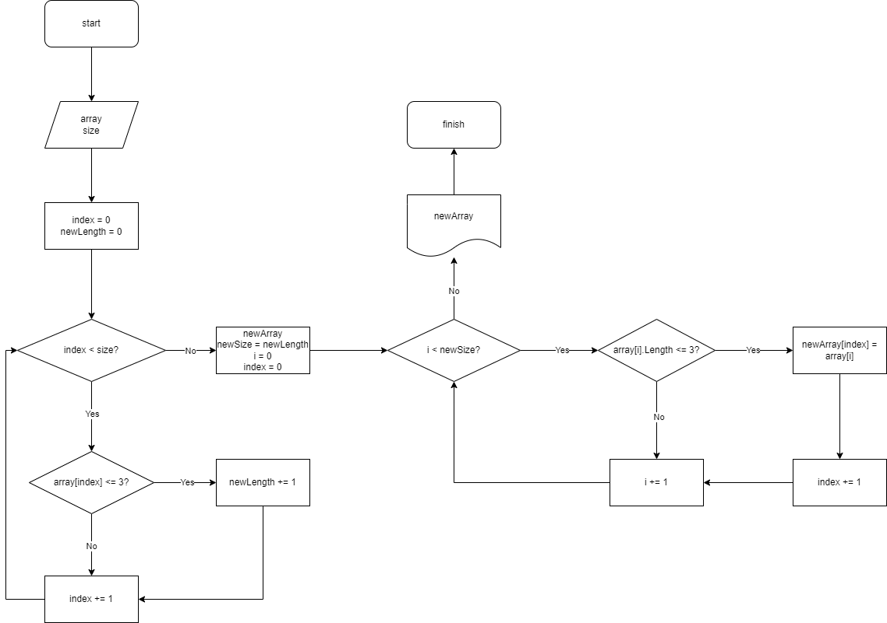

# Контрольная работа 25.07.2023 по основному блоку обучения
## Содержание:
- [Оглавление](#содержание)
- [Создание удалённого репозитория](#1-шаг)
- [файл README.md (создание)](#2-шаг)
- [файл Program ч.1](#3-шаг)
- [файл Program ч.2](#4-шаг)
- [Блок-схема (алгоритма действия)](#5-шаг)
- [файл README.md (редактирование)](#6-шаг)
- [После каждого шага](#после-каждого-шага)
- [Блок-схема (изображение)](#блок-схема)
---
## 1 шаг:
Сначала я создал [**удалённый репозиторий**][1], далее клонировал его. После всех этих действий я подготовил несколько файлов: __.gitignore, README и файлы dotnet__.
## 2 шаг:
Я прописал файл **README**: письменно указал шаги решения.
## 3 шаг:
В файле **Program** создал функцию, которая позволяет извлечь каждый элемент массива в той последовательности, в которой они стоят. Создал 3 массива из примера и проверил действие функции.
## 4 шаг:
В файле **Program** создал _функцию, преобразующую массив, длина элементов которого меньше либо равна 3_. Проверил на 3 примерах задачи, а также задал свой массив.
## 5 шаг:
Составил _блок-схему_ и прикрепил к файлу **README.md**. Картинку PNG с блок-схемой закинул в .gitignore, чтобы не занимало много памяти.
## 6 шаг:
Оформил файл **README.md** ссылками на шаги, внутри шагов также дполнительно оформил нужные элементы.
## После каждого шага:
После каждого шага, а также иногда несколько раз во время реализации одного шага, _**прописывал коммиты и заливал на [удалённый репозиторий][1]**_.
## Блок-схема:

[1]: https://github.com/Dmitry-Osipov/Control_work